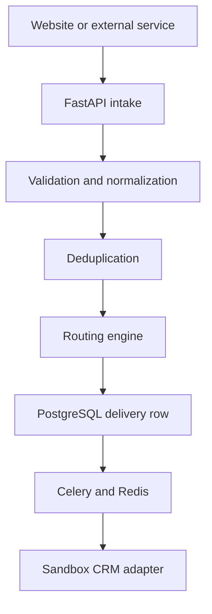

# PipelineSync

CRM lead routing and webhook automation. Incoming leads are validated, normalized, checked for duplicates, routed by ordered rules, and delivered to a **sandbox** CRM adapter.

Demo environment. All contacts and companies are fictional. This project never talks to live HubSpot, Pipedrive, or Zoho accounts.

## Architecture



| Layer | Stack |
| --- | --- |
| API | FastAPI, Pydantic v2, SQLAlchemy 2 (async) |
| Jobs | Celery, Redis, exponential retry, dead-letter |
| Data | PostgreSQL, Alembic |
| UI | React, TypeScript, Vite, TanStack Query, Recharts |
| Tests | pytest, Vitest |

## Quick start (Docker)

```bash
cp .env.example .env
docker compose up --build
```

- API: http://localhost:8000/docs
- Dashboard: http://localhost:8080
- Health: http://localhost:8000/health

Sign in as `admin@pipelinesync.demo` / `demo12345`.

## Local backend (without Docker)

```bash
cd backend
python -m venv .venv
source .venv/bin/activate
pip install -e ".[dev]"
export TESTING=true SECRET_KEY=dev-secret
uvicorn app.main:app --reload --port 8000
```

Postgres + Redis are required when `TESTING` is not true. Then:

```bash
alembic upgrade head
python -m app.seed
celery -A app.workers.celery_app.celery_app worker -l info
```

## Tests

```bash
cd backend && pytest
ruff check app tests
ruff format --check app tests
mypy app
cd ../frontend && npm ci && npm test && npm run typecheck && npm run build
```

## Public intake

```http
POST /api/v1/intake/leads
X-API-Key: demo-api-key
Idempotency-Key: unique-request-key
```

```json
{
  "first_name": "Maya",
  "last_name": "Chen",
  "email": "maya.chen@example.com",
  "phone": "+44 20 7946 0958",
  "company": "Northstar Studio",
  "country": "GB",
  "service": "CRM integration",
  "budget": 8500,
  "currency": "USD",
  "source": "website",
  "external_id": "FORM-10482"
}
```

Replaying the same idempotency key and payload returns the original response. A different payload with the same key returns `409 duplicate_idempotency_key`.

Error envelope:

```json
{ "error": { "code": "invalid_email", "message": "Email address is not valid.", "request_id": "req_..." } }
```

## Domain rules

- Duplicate match order: normalized email, then E.164 phone, then source + external_id. Duplicates are stored, never deleted.
- Routing is first enabled match by `priority` ascending. If none match, the Default CRM Sandbox (webhook) is used.
- Deliveries: `queued → processing → delivered | failed`. Failures schedule retries at 30s, 2m, 10m, then `dead_letter`. Manual retry is available from the UI.
- CSV export prefixes cells that start with `= + - @` to block formula injection.
- API keys are stored as SHA-256 hashes. Passwords are bcrypt hashes.

## Demo walkthrough

See [DEMO.md](DEMO.md).
